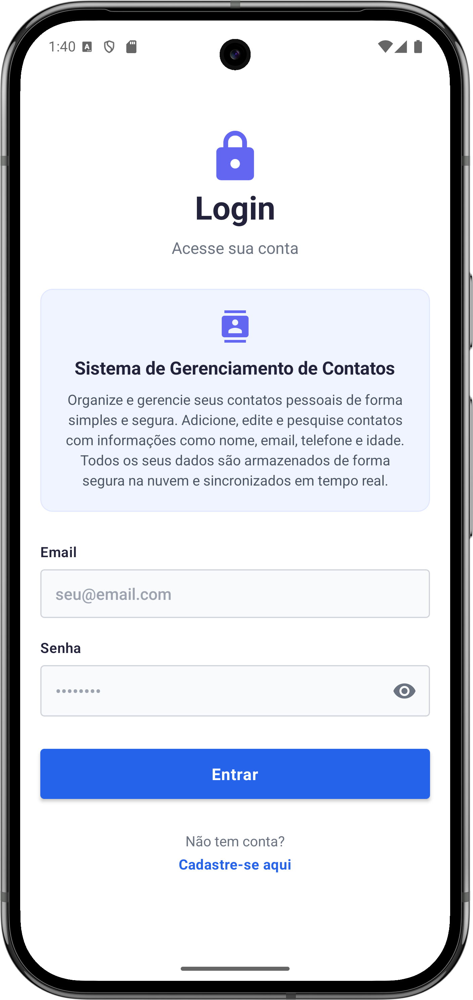
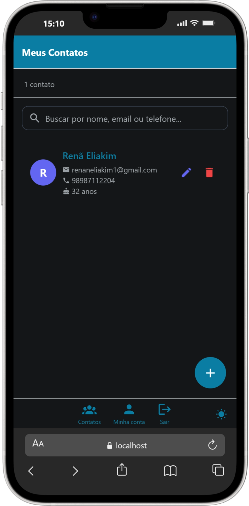

# Sistema de Gerenciamento de Contatos 📱

Um aplicativo React Native desenvolvido com Expo para gerenciar contatos pessoais de forma simples e segura. Com autenticação e armazenamento em nuvem via Firebase, e uma **interface deslumbrante que conta com suporte total a temas Claro/Escuro** e adaptação nativa para as mais diversas telas!

<p align="center">
  
  
  
</p>

## ✨ Novidades e Funcionalidades Recentes

O aplicativo passou por uma repaginada visual gigantesca e ganhou várias funções de navegação amigáveis:

- 🎨 **Tema Dinâmico (Claro/Escuro)**: Agora o app possui um belo design dinâmico alimentado por um `ThemeProvider`. Seja com o fundo escuro elegante `#000000` (Dark Mode) ou um clássico fundo claro `#FFFFFF` (Light Mode), as margens, cartões e botões se adaptam dinamicamente!
- 🔍 **Busca em Tempo Real Aprimorada**: Uma barra de pesquisas flutuante que filtra em *live time* por *Nome*, *Telefone* ou *Email* direto da Dashboard!
- ✨ **Header Personalizado com Ícone de Perfil**: Header superior amigável, onde você acessa a sua conta para atualizar os próprios dados do respectivo usuário conectado.
- 👆 **Novo Botão Flutuante (FAB)**: O botão de "Adicionar" (➕) agora possui um cálculo matemático dinâmico via `useSafeAreaInsets()`. Isso garante que ele flutue de forma perfeita e limpa, independentemente de onde termina o Bottom Menu físico em aparelhos Android mais antigos (Poco, Xiaomi) ou nos gestos dos iPhones e Androids recentes.
- � **Performance de Rede Corrigida**: Implementamos o *Long Polling* do Firebase e o Polyfill do *Cross-Fetch* em ambientes nativos para assegurar funcionamento fluido nos Emuladores Expo Go e Aparelhos Físicos blindando interceptações maliciosas de redes de provedoras.

## 📱 Telas do Aplicativo
- **👤 Perfil do Usuário (`ProfileScreen`)**: Atualize o seu próprio Telefone, Nome, Email ou sua Idade diretamente do painel de configuração de usuário — com suporte ao deslogar da plataforma.
- **🔐 Autenticação Segura (`LoginScreen` / `RegisterScreen`)**: Acesso restrito protegido pelo Firebase Auth.
- **🔑 Recuperação de Senha (`ForgotPasswordScreen`)**: Acabou esquecendo a senha? Informe o e-mail cadastrado e enviamos um link para você com poucos toques!
- **📖 Lista de Contatos (`ContactListScreen`)**: Uma lista *FlatList* organizada com animações, pesquisa de filtros e cards robustos formatados em Real-time via *Firebase Snapshot*.
- **➕ Adição/Edição de Contatos (`AddContactScreen` / `EditContactScreen`)**: Atualize e adicione detalhes pontuais à sua lista com o formulário padrão.

## 🚀 Como executar o projeto

### 1. Instalar dependências

```bash
npm install
```

### 2. Configurar Firebase

#### 2.1. Criar projeto no Firebase

1. Acesse o [Firebase Console](https://console.firebase.google.com/)
2. Clique em **"Adicionar projeto"** ou **"Create a project"**
3. Digite o nome do projeto (ex: "meu-app-contatos")
4. Aceite os termos e clique em **"Continuar"**
5. Desabilite o Google Analytics (opcional) e clique em **"Criar projeto"**
6. Aguarde a criação e clique em **"Continuar"**

#### 2.2. Adicionar app Web ao projeto

1. No painel do projeto, clique no ícone **"Web"** (`</>`)
2. Digite um apelido para o app (ex: "Meu App Web")
3. **Não** marque "Firebase Hosting" por enquanto
4. Clique em **"Registrar app"**
5. **Copie as credenciais de configuração** que aparecerem

#### 2.3. Configurar Authentication e Firestore Database

Siga a documentação do Firebase para ativar os métodos e configurar as regras de database. Exija autenticação: (`request.auth != null;`)

#### 2.4. Adicionar configurações do Firebase ao projeto `.env`

Na Raiz do projeto, crie o arquivo `.env` alimentando os super segredos que copiou no passo de registro para as variáveis Expostas da plataforma da `Expo`:

```env
EXPO_PUBLIC_FIREBASE_API_KEY=ABC123DEF456...
EXPO_PUBLIC_FIREBASE_AUTH_DOMAIN=app-teste.firebaseapp.com
EXPO_PUBLIC_FIREBASE_PROJECT_ID=app-teste
EXPO_PUBLIC_FIREBASE_STORAGE_BUCKET=app-teste.appspot.com
EXPO_PUBLIC_FIREBASE_MESSAGING_SENDER_ID=91919191
EXPO_PUBLIC_FIREBASE_APP_ID=1:91919191:web:abcdef123
EXPO_PUBLIC_FIREBASE_MEASUREMENT_ID=G-ABCD123
```

*(Lembre-se: O aplicativo puxará as variáveis de ambiente ativando um **long polling** automático na inicialização caso a rede apresente falhas nas conexões locais!)*

### 3. Iniciar o app

```bash
npx expo start
```

No terminal, você terá opções para abrir o app em:

- [Android emulator](https://docs.expo.dev/workflow/android-studio-emulator/)
- [iOS simulator](https://docs.expo.dev/workflow/ios-simulator/)
- [Expo Go](https://expo.dev/go) - app de desenvolvimento via QR Code
- Web browser (pressione `w` no terminal)

## 📦 Gerar e Baixar APK para Android Localmente

Quer enviar o app aos seus conhecidos de forma oficial via Arquivo Estalável do Android em vez de compartilhar Links do Expo Go?  
Eu configurei o EAS (Sistema de Computação em Nuvem da Expo) para compilar e montar o `APK` pra você! 😁

### Preparativos
- Instale a biblioteca `npm install -g eas-cli` no computador caso não tiver.

### Passo 1: Autenticação
```bash
eas login
```

### Passo 2: Gere o Compilado!
Mande o projeto às nuvens do Expo rodando:
```bash
npx eas build -p android --profile preview
```

- Quando terminar a Fila, o Terminal emitirá a mensagem de Sucesso junto com o `QR Code` a um hiperlink da sua página da Web EAS Cloud! 
- Basta pegar os celulares de testes (ex: POCO F7), abrir, ir nas fontes desconhecidas e fazer a instalação!

## 🛠️ Tecnologias utilizadas

- **React Native** - Framework para desenvolvimento mobile
- **Expo Framework** - Plataforma para desenvolvimento React Native e EAS Build.
- **TypeScript** - Tipagem estática
- **Firebase Auth / Firebase Firestore** - Autenticação e Bancos de Alta escala NoSQL em tempo real.
- **React Navigation e React Native Reanimated** - Navegação Mestre e Animações Transicionais robustas!
- **React Native Safe Area Context** - Cálculo de Posicionamento e Intersecção da física do display.
- **Expo Vector Icons** - Ícones limpos do universo do Material Community Icons!

## 📄 Licença
Este projeto foi desenvolvido para fins educacionais e pessoais.

## 👨‍💻 Autor

Desenvolvido por [@renaneliakim1](https://github.com/renaneliakim1)
